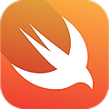

# 100 days of swift 

 | 100 days of Swift is a marathon for learning Swift created by Paul Hudson creator and writer of the Hacking with Swift blog. [**Oficial site 100 days of Swift**](https://www.hackingwithswift.com/100)
:--------- | :------

 ## **The marathon premises:**

1 - Read and practice Swift for at least 1 hour every day

2 - Talk and share with others about your progress

### **Topics covered**

Collections  
Loops  
Conditionals  
Protocols  
Extensions  
Opcionais  
Closures  
UIKit  
Auto Layout  
iOS Navigation  
Core Animation  
Codable  
SpriteKit  
UserDefaults  
Core Image  
Mapkit  
iBeacons  
Core Location  
Core Motion  
Core Graphics  

